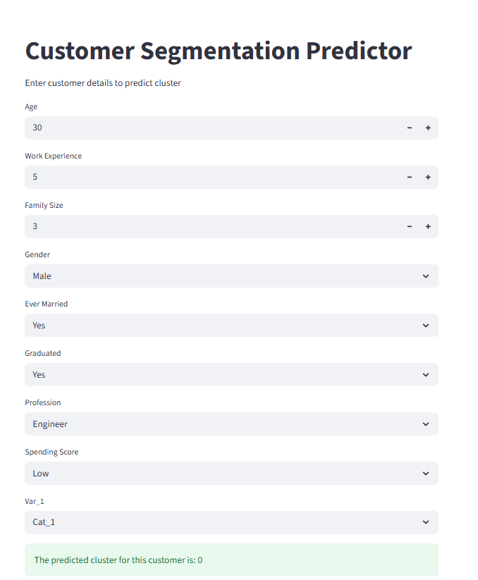

# Customer Segmentation Project

## Project Overview
This project performs **customer segmentation** using **K-Means clustering** on a Kaggle dataset.  
The goal is to categorize customers into meaningful clusters based on demographic and behavioral features.  

## Dataset
- **Train dataset**: Contains customer details along with the target `Segmentation` column (A, B, C, D).  
- **Test dataset**: Contains customer details without segmentation labels.  

**Columns in dataset:**
- `ID` : Customer ID  
- `Gender` : Male/Female  
- `Ever_Married` : Yes/No  
- `Age` : Numeric  
- `Graduated` : Yes/No  
- `Profession` : Engineer, Lawyer, Healthcare, Entertainment, etc.  
- `Work_Experience` : Numeric, in years  
- `Spending_Score` : Low, Average, High  
- `Family_Size` : Numeric  
- `Var_1` : Categorical  
- `Segmentation` : Target column (Train dataset only)  

## Steps Performed

### 1. Data Preprocessing
- Handle **missing values**:
  - Numeric columns: fill with median  
  - Categorical columns: fill with mode  
- Encode categorical columns using **One-Hot Encoding**  
- Align test dataset columns with train dataset features  

### 2. Feature Scaling
- Used **StandardScaler** to scale numeric features  
- Scaling ensures that all features contribute equally to K-Means clustering  

### 3. Clustering
- Used **K-Means clustering** for segmentation  
- **Elbow Method** used to find the optimal number of clusters  
- Train dataset fitted using K-Means → clusters assigned  
- Test dataset predicted using trained K-Means model  

### 4. Streamlit User Interface
- **Interactive form** for user to input customer details  
- **Predicts cluster** in real-time using trained scaler + K-Means model  
- Aligns user input with train features for accurate prediction

# Streamlit User Interface

- Interactive form for customer input:

## Libraries Used
- pandas  
- numpy  
- scikit-learn  
- matplotlib  
- seaborn  
- streamlit  
- pickle  

